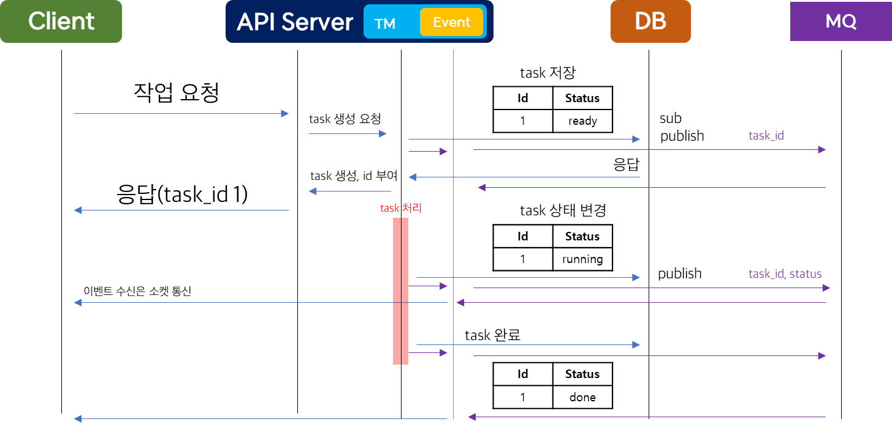

## Task Manager 구현
### 목적

- 각 플랫폼의 비동기 Task의 Status를 관리하는 라이브러리와 Task Manager(이하 TM) 서버를 구현
- Client에서는 요청한 Task의 Status를 실시간으로 응답 받을 수 있음
- 관리자는 각 플랫폼에서 요청한 Task의 Status와 Log를 열람할 수 있음

### 기술 스택
- RabbitMQ
- JPA
- Spring Boot
